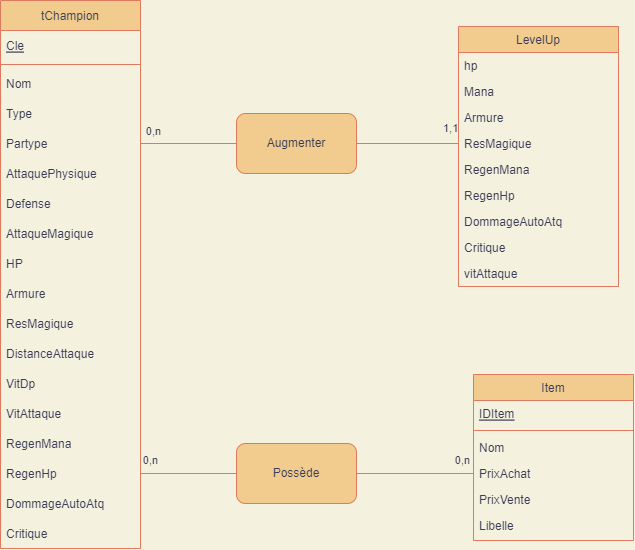
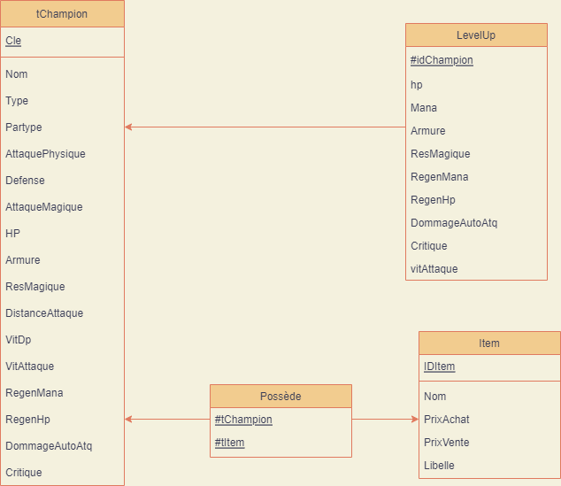
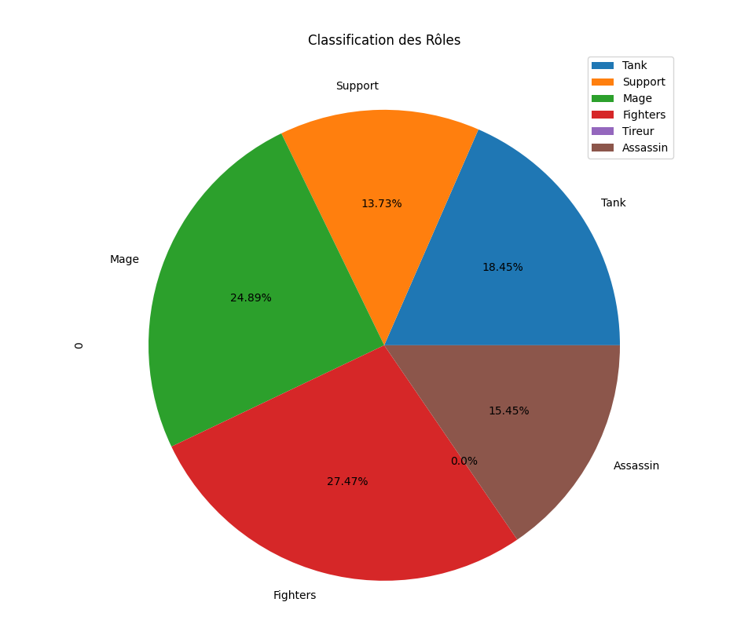
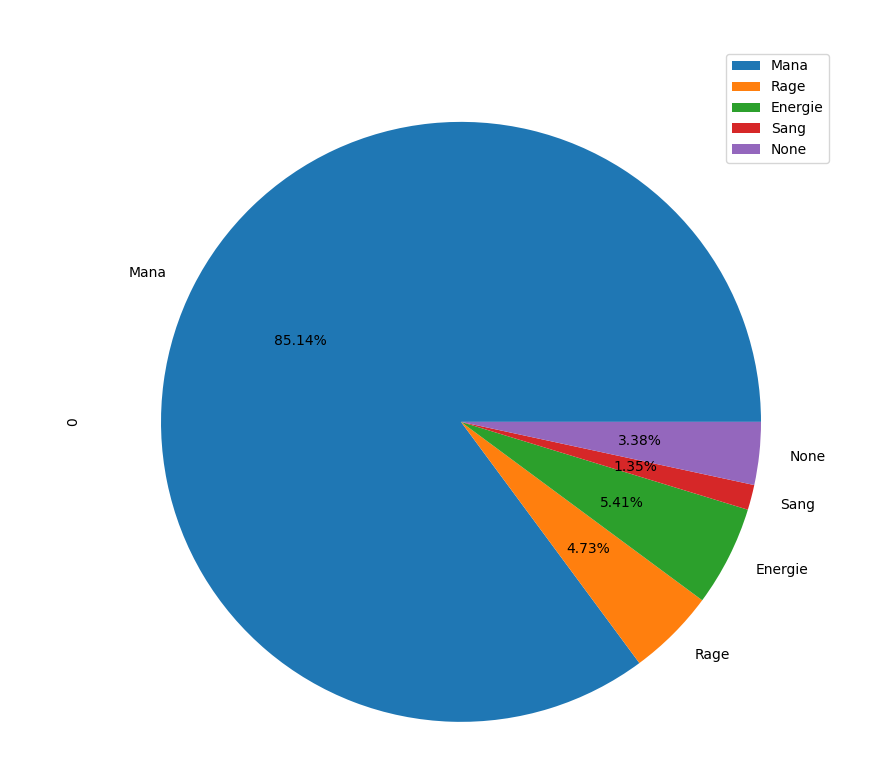
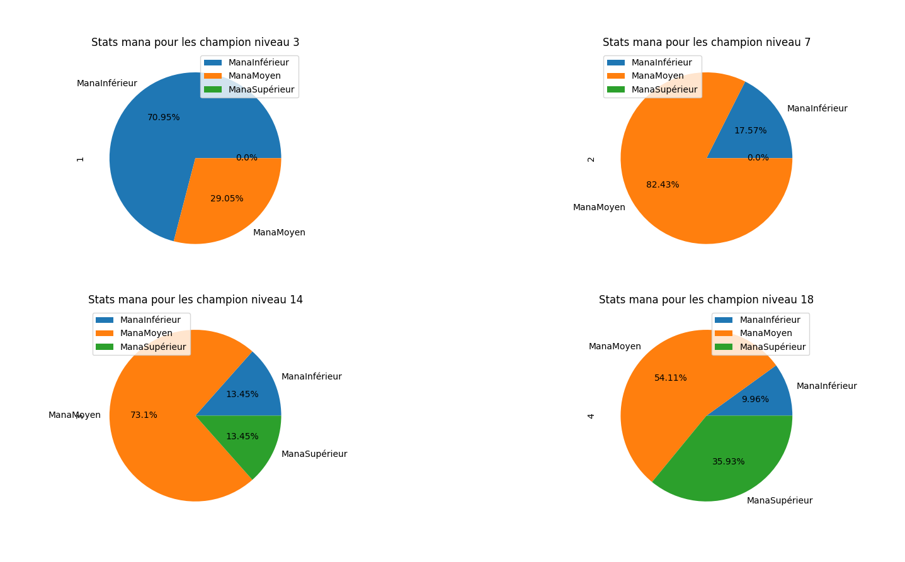
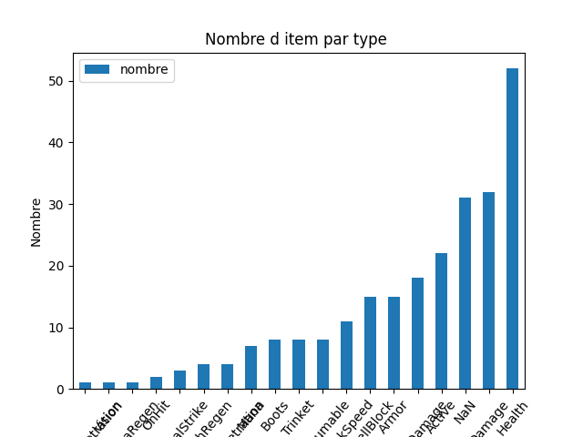
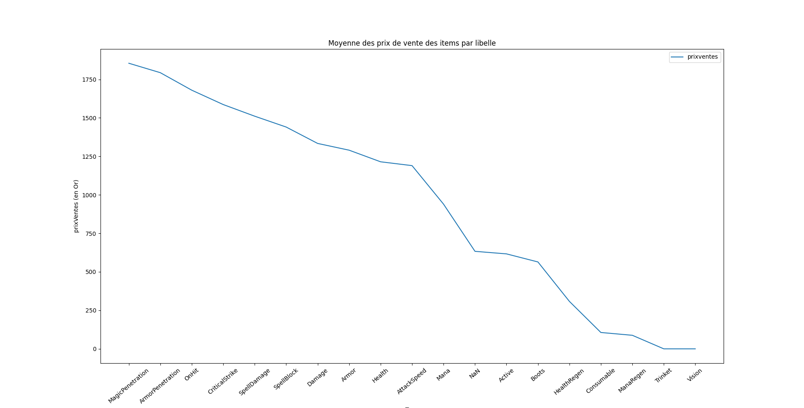
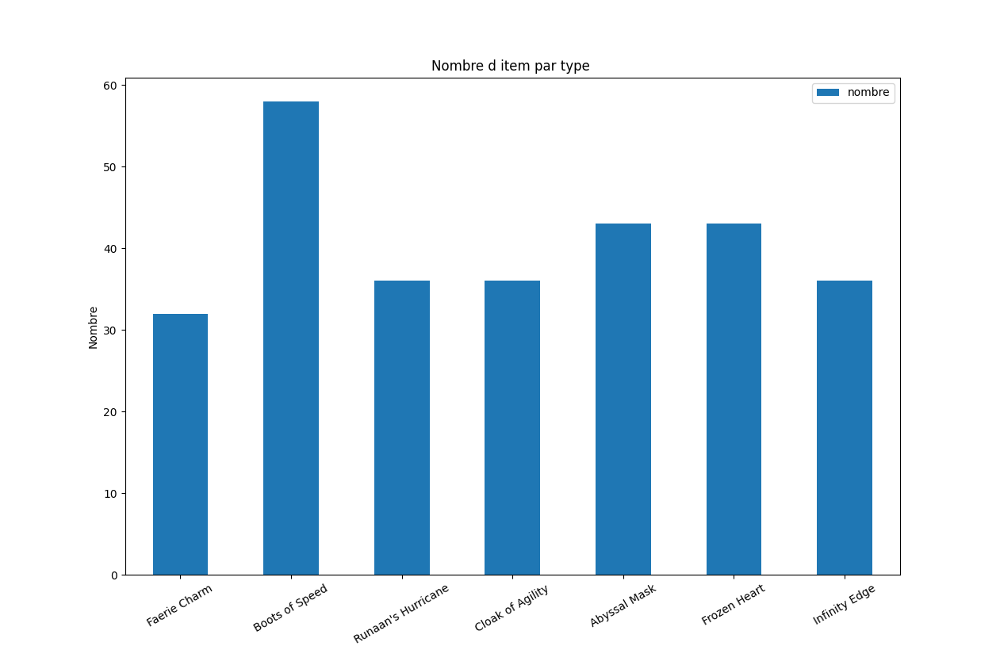

# Présentation du jeu de donnée

Dans le cadre de  notre SAE 2.04 : Exploitation d'une base de données, nous avons choisie de traiter un jeu de donnée sur le thème de League of Legends. C'est un jeu pc qui reprendra l'ensemble des personnages du jeu ainsi que ses items.
Lien de notre bases de données [LOL-Champions and Item](https://www.kaggle.com/datasets/gyejr95/league-of-legendslol-champion-and-item-2020).

 

## Personnages
 
Il faut savoir que notre jeu donnée comprend les 149 personnages du jeu et que celui-ci propose des caractériser les personnages par genre (ex : *Mage*, *Tank*, ...), mais nous avons aussi les caractéristique des personnages (ex : hp, distance d'attaque, attaque, armure, ...), nous aurons en plus l'augmentation des attributs de chaque personnage.  Ex: un personnage a 10 point de vie, en augmentent de niveau, ses points de vie augmente de 5. 

 

## Objet

 

Notre jeu de donnée comprend les 243 items du jeu. Il faut savoir que certains items ont des caractéristiques différentes, mais dans le cadre de notre jeu de donnée, pour le simplifié, nous avons fait le choix d'afficher que sa caractéristique principal. Ainsi, nous pourrons faire des requêtes et graphes par rapport au type d'item ainsi que son prix pour permettre aux joueurs de facilité leurs recherche dans la quête du meilleurs équipement.

 

## *Idées-Requete*

 

1- Afficher le nombre de champion au total. 
2- Afficher l'identifiant "blitzcrank". 
3- Afficher le Champions qui fait le plus de dégâts par coup (sans technique). 
4- Afficher les Champions qui possède plus de dégâts magique que de dégats physique. 
5- Afficher le Champions qui possède les meilleurs statistiques (somme de tous les statistiques).< 
6- Afficher le personnages avec le plus d'hp (point de vie) au niveau maximum, sans item (objet). 
7- Combien d'attaque aurais gnar si on l'augmente du niveau 3 au niveau 15. 
8- Affiche celui qui a le plus de dégât physique.  
9- Combien d'item "botte" y a-t-il dans la liste d'item. 

- Afficher un histogramme du nombre d'item posséder par un champion.
- Afficher un histogramme en fonction du nombre de libelle d'item.

- Courbe pour la moyenne des prix de vente des items par libelle. 

- Afficher en camembert le taux des différents Etiquettes (tank, support, ...).
- Afficher en camembert le taux des différents types (mana / rage / rien).

Comparaison de camembert :
- Afficher 3 camembert :
     - niv 3 : Mana < 450 et Mana > 950
     - niv 7 : Mana < 450 et Mana > 950
     - niv 14 : Mana < 450 et Mana > 950
     - niv 18 : Mana < 450 et Mana > 950

*Mana = Pouvoir Magique*

## MCD

 

## MLD

 
 

## Description des diagrammes

### Diagramme circulaire

Nous allons commencer par la description des diagrammes circulaires.

 

Dans ce diagramme, nous faisons une étude sur les caractéristiques des champions. En effet, nous voulons savoir le pourcentage de chaque rôle de personnage qui est présent dans le jeu. Il y a plusieurs, nous avons des Mage, Support, Tank, Assassin et les Combattants (‘Fighter’). Comme nous pouvons le voir ci-dessus, nous avons une majorité de fighter avec 27.47% des champions, suivi de près par les mages 24.89% des champions. Puis enfin, nous avoir 18.45% de tank, 15.45% d'assassin et 13.73% support

Pour être plus précis, nous avons 64 fighter, 58 mages, 43 tanks, 36 assassins et 32 supports. Il faut aussi savoir qu'un champion peut avoir plusieurs rôle ce qui expliquer que l'addition de tous les rôles donne un nombre supérieur au nombre total de champion qui est de 148.

 

     
Ce diagramme nous permet de connaitre en pourcentage ce que consomme chaque champion pour le combat. Le type mana est sans aucun doute le type le plus utilisé du jeu avec ces 85.14% de champions qui s'en sert. Vient ensuite le type énergie qui est lui utilisé à hauteur de 5.41%. 

Il reste donc le type rage et sang utiliser respectivement à hauteur de 4.73% et 1.35%. Pour finir il y a également des personnages qui n’utilisent pas d'énergie et ce dernier représente 3.38% des champions du jeu.

 

Passons maintenant aux choses sérieuses, nous allons faire une étude de l'évolution de mana max de l'ensemble des champions en fonction de leurs niveaux. En effet, à chaque niveau, les champions upgradent leurs manas max.

Nous allons commencer par le niveau 3 puis 7 puis 14 et enfin 18. Nous allons chercher le pourcentage de champion ayant moins de 450 de mana max, puis entre 450 et 950 et enfin plus de 950 mana.

Comme nous pouvons le voir, pour les champions de niveau 3, à peu près ou les combats d’équipe (‘Team fight’) commencent. Plus de 70% des champions ont moins de 450 de mana, moins de 30% des champions ont entre 450 et 950 de mana. Alors qu'aucun champion n'a encore plus de 950 de mana.2cm

Nous arrivons aux champions de niveau 7. On constate qu'aucun n'a encore dépassé le seuil des 950 manas max, alors qu'on peut voir une nette augmentation des champions de plus de 50% passant de moins de 450 de mana à l'intervalle [450, 950] de mana.

Ensuite nous lorsque les champions passent le niveau 14, nous pouvons constater que nous passons enfin le seuil des 0% pour les champions ayant plus de 950 mana max. Environ 13.5% des champions sont dans cette catégorie. Le passage dans cette catégorie explique la légère diminution des 2 autres seuils.

Enfin, lorsque les champions passent le niveau 18, on peut voir que le nombre de champions ayant plus de 950 manas max a presque triplé. Alors que les champions ayant moins de 450 de mana sont presque ceux, qui ne consomme pas le type mana.

Pour conclure cette étude, comme nous avons pu le voir dans précédente requête, une majorité du jeu consomme du mana, ce qui explique au niveau maximum (18), une grande majorité soit vers les + 950 et sur l'intervalle [450, 950].

 

### Diagramme bâton

Nous allons continuer par la description de diagramme circulaire.

 

 

Ici, comme nous le montre le graph, nous affichons le nombre d'item par rapport au type de l'item. Ici, on peut remarquer que nous avons majoritairement des items de Heal/vie. Suivi par des items pour augmenter le damage/dégât. Nous avons malheureusement des items dont nous n'avons pas pu déterminer le type précisément, donc ils sont multi types. Les items ‘Actifs' sont des items qui donne des states, mais qui offre la possibilité de l'activer comme une compétence dans une partie. L'objectif sera de permettre à l’utilisateur de se rendre compte des répartitions majeures des types d'item.

### Courbe

Pour finir, nous allons faire une étude d'une courbe.
 

Dans ce document, nous offrons la possibilité d'afficher les items qui coute le plus cher aux joueurs en fonction du type de l'item. Comme nous pouvons le voir, les items qui reviennent le plus cher aux joueurs seront la pénétration magique et physique. Il est intéressant de remarquer, qu'apporter de la vision de jeu, qui est très important lors d'une partie, ne coute pas grand-chose.

